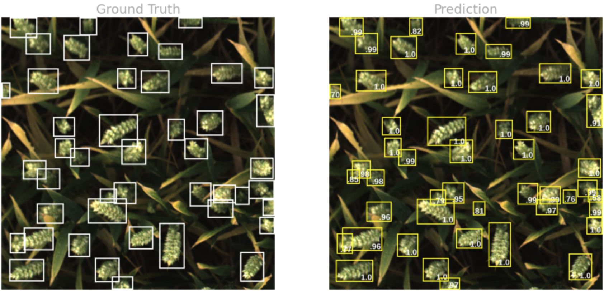

# Global Wheat Detection - Object Detection Using MMDetection Toolbox

  
  
 

 

This repo contains three notebooks that use the [MMDetection](https://github.com/open-mmlab/mmdetection) toolbox to train different models that detect wheat heads from images of wheat plants. The data used comes from the [Global Wheat Detection](https://www.kaggle.com/c/global-wheat-detection) competition provided by [The Global Institute for Food Security (GIFS)]( https://www.gifs.ca/) at the University of Saskatchewan (USask). 

Each notebook has been set up to train the 3 types of detectors, but each trains only one of them. All detectors require a GPU for training.

1. Faster RCNN 50 (Ren et al., 2017)
2. DetectoRS (Qiao et al., 2020) 
3. Generalized Focal Loss (Li et al., 2020) 

Experimenting with various parameter settings and data pipelines better results were achieved with the Generalized Focal Loss and DetectoRS models (in that order), but the Faster RCNN 50 achieved good results much faster and it is much lighter weight. Additionally, the Faster RCNN 50 can be used for inference using either a CPU or a GPU, while the other 2 require a GPU. 

To train the detectors I have created a set of annotation files in both Pascal VOC (xml) and COCO (json) format, and are available (along with the code used to create them) [in this repo](https://github.com/reyvaz/Global-Wheat-XML-and-COCO-Annotations). Training in these notebooks use only the COCO style annotations, however I have set up both file systems so that either can be used. Some of the VOC files are required for the visualization utils. 

**Reproducing the Notebook**

For reproducing the notebooks it is required that the `global-wheat-detection.zip` file containing the data be available in the `\content` directory. Due to data restrictions I am not able to share this file, however, it can be obtained [here]( https://www.kaggle.com/c/global-wheat-detection/data).

 

